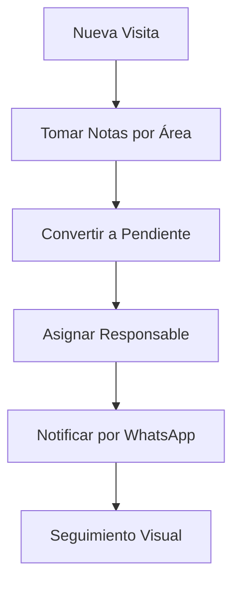
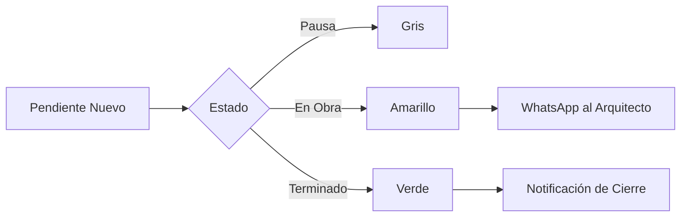
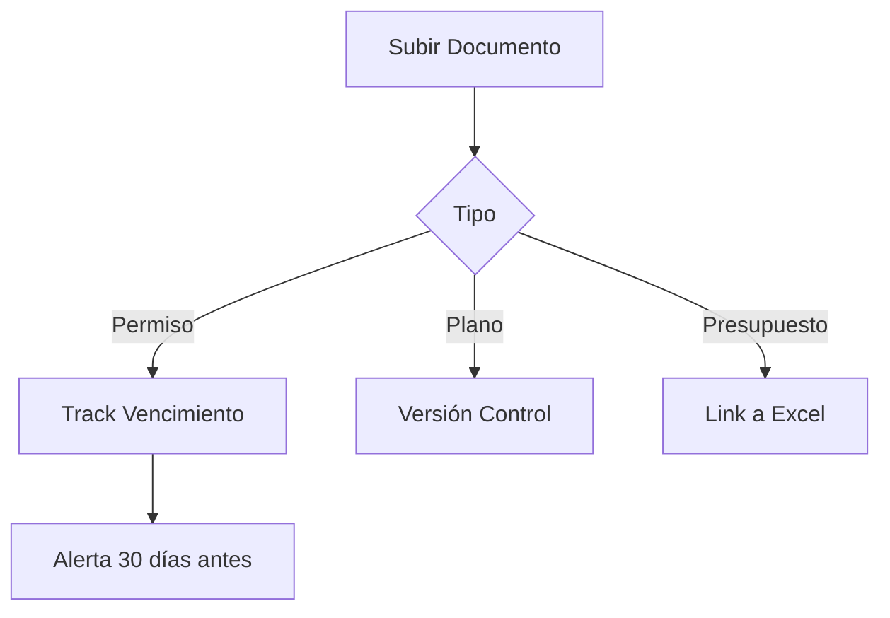

# ESANT MARIA - Sistema de Gestión de Proyectos Arquitectónicos

## Contexto del Proyecto

ESANT MARIA es una plataforma web mobile-first diseñada para gestionar proyectos de arquitectura, facilitando la coordinación entre especialistas y la comunicación directa con el equipo. El objetivo es consolidar herramientas dispersas (Excel, WhatsApp, Drive, Email, papel) en una solución centralizada, simple y visual.

**Cliente:** Felipe Larraín (INVALS)  
**Fecha inicio:** Octubre 2025  
**Estado:** Fase de desarrollo - MVP  
**Última revisión de diseño:** Noviembre 6, 2025

## Sistema de Diseño - Noviembre 2025

### Paleta de Colores Actualizada

```css
colors: {
    'esant': {
      'black': '#000000',      // Negro puro - Botones principales, texto, menú
      'white': '#FFFFFF',      // Blanco puro - Fondos de cards
      'gray': {
        100: '#F5F5F5',        // Fondos de página
        200: '#E8E8E8',        // Bordes, divisores
        400: '#9E9E9E',        // Texto secundario
        600: '#757575',        // Iconos inactivos
        800: '#424242',        // Texto principal
      },
      'red': '#F44336',        // Notificaciones, alertas
      'green': '#25D366',      // WhatsApp
    }
}
```

**Referencia completa:** Ver `esant-maria-design-system.md` para detalles de implementación

### Sistema de Botones

```css
.btn-primary {
  background: #000000; /* Negro puro */
  color: #ffffff;
  padding: 12px 24px;
  border-radius: 8px;
  font-size: 16px;
  font-weight: 500;
  min-height: 44px; /* Touch target mínimo */
}

.btn-whatsapp {
  background: #25d366; /* Verde WhatsApp */
  color: #ffffff;
  padding: 10px 20px;
  border-radius: 20px; /* Más redondeado */
  font-weight: 500;
}

.btn-accent {
  background: #f44336; /* Rojo para alertas */
  color: #ffffff;
  padding: 12px 24px;
  border-radius: 8px;
}

.btn-secondary {
  background: #e8e8e8; /* Gris claro */
  color: #424242; /* Texto gris oscuro */
  padding: 8px 16px;
  border-radius: 8px;
}
```

**Componente React:** `client/src/components/common/Button.tsx`

## Filosofía de Diseño

Basado en los 10 principios de buen diseño de Dieter Rams:

1. **Innovador** - Uso de PWA mobile-first
2. **Útil** - Cada elemento tiene una función clara
3. **Estético** - Minimalista y limpio
4. **Comprensible** - Interfaz autoexplicativa
5. **Discreto** - Sin elementos decorativos innecesarios
6. **Honesto** - No promete más de lo que ofrece
7. **Duradero** - Diseño atemporal
8. **Detallado** - Cada pixel tiene propósito
9. **Sustentable** - Ligero y eficiente
10. **Menos es más** - Solo lo esencial

### Aplicación Práctica

- **Super amigable:** Interfaz clara sin complejidad visual
- **Straight-forward:** Acciones directas, sin menús anidados
- **Mobile-first:** Diseñada para usar con una mano en obra
- **Visual pero simple:** Estados con colores claros, mínimo uso de íconos
- **Cards limpios:** Fondo blanco (#FFFFFF), sombras sutiles, espaciado generoso
- **Tipografía legible:** Tamaños claros (16px base), jerarquía visual mediante peso, no color
- **Footer constante:** "ESANT MARIA" siempre visible
- **Colores sólidos:** Sin gradientes ni efectos decorativos
- **Alto contraste:** Negro sobre blanco para máxima legibilidad

**Referencia completa:** Ver `esant-maria-design-system.md`

## Componentes UI Actualizados

### Sistema Tipográfico (Basado en Dieter Rams)

```css
/* Tamaños de fuente */
--text-xs: 12px; /* Metadata, timestamps */
--text-sm: 14px; /* Texto secundario */
--text-base: 16px; /* Texto principal */
--text-lg: 18px; /* Subtítulos */
--text-xl: 20px; /* Títulos de sección */
--text-2xl: 24px; /* Títulos principales */

/* Pesos */
--font-normal: 400;
--font-medium: 500;
--font-semibold: 600;
--font-bold: 700;
```

**Font Family:** `-apple-system, BlinkMacSystemFont, "Segoe UI", Roboto, sans-serif`

### Cards

```css
.card {
  background: #ffffff;
  border-radius: 16px;
  padding: 16px;
  box-shadow: 0 2px 8px rgba(0, 0, 0, 0.06);
}
```

**Componente React:** `client/src/components/common/Card.tsx`

### Badges (Indicadores)

```css
.badge-count {
  background: #f44336; /* Rojo */
  color: #ffffff;
  min-width: 24px;
  height: 24px;
  border-radius: 4px;
  font-weight: 600;
  font-size: 14px;
}

.badge-notification {
  background: #000000; /* Negro */
  color: #ffffff;
  padding: 4px 8px;
  border-radius: 12px;
  font-size: 14px;
  font-weight: 500;
}
```

**Componente React:** `client/src/components/common/Badge.tsx`

### Menú Lateral

```css
.menu {
  background: #000000; /* Negro puro */
  color: #ffffff;
  padding: 24px;
  border-radius: 20px;
}

.menu-item {
  padding: 16px 0;
  font-size: 18px;
  font-weight: 500;
  border-bottom: 1px solid rgba(255, 255, 255, 0.1);
}
```

**Características:**

- Fondo negro sólido
- Texto blanco
- Botón "Cambiar proyecto" con indicador visual
- Botón "Cerrar Sesión" en rojo (#F44336)
- Items separados con líneas divisorias sutiles

## Stack Tecnológico

### Frontend

```
- React 18 + TypeScript
- Tailwind CSS (diseño responsive)
- PWA (Progressive Web App)
- React Router (navegación)
- React Query (manejo de estado servidor)
- Zustand (estado local)
```

### Backend

```
- Supabase (PostgreSQL + Auth + Storage + Realtime)
  ✅ IMPLEMENTADO: Noviembre 2025
- JWT Authentication (via Supabase Auth)
- WhatsApp Business API (o links directos para MVP)
```

### Infraestructura

```
- Vercel (hosting frontend)
- Supabase (DB + Auth + Storage + Realtime)
  ✅ IMPLEMENTADO: Configurado y conectado
- Supabase Storage (documentos e imágenes)
```

### DevOps

```
- GitHub (repositorio)
- GitHub Actions (CI/CD)
- ESLint + Prettier (linting)
- Vitest (testing)
```

## Arquitectura del Sistema

### Estructura de Carpetas

```
esant-maria/
├── client/                 # Frontend React
│   ├── public/
│   ├── src/
│   │   ├── components/    # Componentes reutilizables
│   │   │   ├── common/    # Botones, inputs, modales
│   │   │   ├── layout/    # Header, sidebar, navigation
│   │   │   └── features/  # Componentes específicos por feature
│   │   ├── pages/         # Vistas principales
│   │   │   ├── Visitas/
│   │   │   ├── Pendientes/
│   │   │   ├── Equipo/
│   │   │   ├── Documentos/
│   │   │   ├── Presupuesto/
│   │   │   ├── Permisos/
│   │   │   ├── Notas/
│   │   │   └── Notificaciones/
│   │   ├── hooks/         # Custom hooks
│   │   ├── utils/         # Funciones auxiliares
│   │   ├── services/      # API calls
│   │   ├── store/         # Zustand stores
│   │   ├── types/         # TypeScript types
│   │   ├── constants/     # Constantes
│   │   └── App.tsx
│   ├── package.json
│   └── vite.config.ts
│
├── server/                # Backend Node/Express
│   ├── src/
│   │   ├── controllers/   # Lógica de negocio
│   │   ├── routes/        # Endpoints API
│   │   ├── models/        # Modelos Prisma
│   │   ├── middleware/    # Auth, validación
│   │   ├── services/      # Servicios externos (WhatsApp, etc)
│   │   ├── utils/         # Helpers
│   │   └── server.ts
│   ├── prisma/
│   │   └── schema.prisma
│   ├── package.json
│   └── tsconfig.json
│
├── shared/                # Código compartido (types, utils)
│   └── types/
│
└── docs/                  # Documentación
    ├── CLAUDE.md         # Este archivo
    ├── API.md            # Documentación API
    └── DEPLOYMENT.md     # Guía de despliegue
```

## Modelo de Datos

### Entidades Principales

```typescript
// User (Usuario)
{
  id: string
  email: string
  nombre: string
  rol: 'admin' | 'jefe_proyecto' | 'especialista' | 'cliente'
  telefono: string
  especialidad?: string  // Para especialistas
  avatar?: string
  proyectos: Proyecto[]
  createdAt: Date
  updatedAt: Date
}

// Proyecto
{
  id: string
  nombre: string
  cliente: string
  estado: 'planificacion' | 'en_obra' | 'pausado' | 'terminado'
  fechaInicio: Date
  fechaEstimadaFin?: Date
  direccion?: string
  descripcion?: string
  presupuestoTotal?: number
  usuarios: User[]  // Equipo del proyecto
  visitas: Visita[]
  pendientes: Pendiente[]
  documentos: Documento[]
  notas: Nota[]
  presupuestoItems: PresupuestoItem[]
  createdAt: Date
  updatedAt: Date
}

// Visita
{
  id: string
  proyectoId: string
  fecha: Date
  hora?: string  // Hora programada (ej: "10:00")
  estado: 'programada' | 'en_curso' | 'completada'
  notasGenerales?: string  // Notas generales de la visita
  asuntos: Asunto[]  // Temas por área
  creadoPor: string  // userId
  createdAt: Date
  updatedAt: Date
}

// Asunto (dentro de una visita) - Tarea específica de un área
{
  id: string
  visitaId: string
  area: string  // "Cocina", "Baño", "Sala de estar", etc
  descripcion: string
  encargadoId?: string  // Usuario asignado
  notasAdicionales?: string
  convertidoAPendiente: boolean
  pendienteId?: string
  createdAt: Date
}

// Pendiente (Tarea)
{
  id: string
  proyectoId: string
  area: string  // Área del proyecto
  tarea: string
  descripcion?: string
  encargadoId: string  // Usuario responsable
  estado: 'pausa' | 'en_obra' | 'terminado'
  prioridad?: 'baja' | 'media' | 'alta'
  fechaCreacion: Date
  fechaVencimiento?: Date
  fechaCompletado?: Date
  notasAdicionales?: string
  creadoPor: string
  visitaId?: string  // Si viene de una visita
  asuntoId?: string  // Si viene de un asunto de visita
  createdAt: Date
  updatedAt: Date
}

// Documento
{
  id: string
  proyectoId: string
  nombre: string
  tipo: 'pdf' | 'docx' | 'xlsx' | 'dwg' | 'jpg' | 'png' | 'otro'
  categoria: 'planos' | 'permisos' | 'anteproyecto' | 'presupuesto' | 'contratos' | 'fotos' | 'otro'
  url: string
  tamaño: number
  estado?: 'borrador' | 'revision' | 'aprobado' | 'vigente' | 'vencido'
  fechaAprobacion?: Date
  subioPor: string
  createdAt: Date
  updatedAt: Date
}

// Nota
{
  id: string
  proyectoId: string
  contenido: string
  area?: string  // Área opcional
  autorId: string
  convertidaAPendiente: boolean
  pendienteId?: string
  createdAt: Date
  updatedAt: Date
}

// Notificacion
{
  id: string
  usuarioId: string
  tipo: 'tarea_asignada' | 'tarea_actualizada' | 'visita_programada' | 'documento_subido' | 'presupuesto_actualizado' | 'mensaje'
  titulo: string
  mensaje: string
  leida: boolean
  metadata?: Record<string, any>  // Datos adicionales según tipo
  enlaceAccion?: string  // URL para ir directo al elemento relacionado
  createdAt: Date
}

// PresupuestoItem
{
  id: string
  proyectoId: string
  categoria: 'diseño' | 'construccion' | 'materiales' | 'mobiliario' | 'otro'
  descripcion: string
  montoEstimado: number
  montoReal?: number
  porcentajeEjecutado: number  // 0-100
  archivoUrl?: string  // Link a Excel externo
  notificaCambios: boolean  // Si debe notificar al actualizar
  ultimaActualizacion?: Date
  createdAt: Date
  updatedAt: Date
}

// Permiso
{
  id: string
  proyectoId: string
  nombre: string
  tipo: 'edificacion' | 'municipal' | 'recepcion_obra' | 'otro'
  estado: 'pendiente' | 'en_tramite' | 'aprobado' | 'vencido'
  fechaSolicitud?: Date
  fechaAprobacion?: Date
  fechaVencimiento?: Date
  vigenciaMeses?: number
  documentoId?: string  // Referencia a documento adjunto
  notas?: string
  createdAt: Date
  updatedAt: Date
}
```

## API Endpoints

### Autenticación

```
POST   /api/auth/register
POST   /api/auth/login
POST   /api/auth/logout
GET    /api/auth/me
POST   /api/auth/refresh
```

### Proyectos

```
GET    /api/proyectos
GET    /api/proyectos/:id
POST   /api/proyectos
PUT    /api/proyectos/:id
DELETE /api/proyectos/:id
GET    /api/proyectos/:id/equipo
POST   /api/proyectos/:id/equipo
DELETE /api/proyectos/:id/equipo/:userId
GET    /api/proyectos/:id/resumen  # Resumen para vista principal
```

### Visitas

```
GET    /api/proyectos/:proyectoId/visitas
GET    /api/visitas/:id
POST   /api/proyectos/:proyectoId/visitas
PUT    /api/visitas/:id
DELETE /api/visitas/:id
POST   /api/visitas/:id/asuntos
PUT    /api/visitas/:id/asuntos/:asuntoId
DELETE /api/visitas/:id/asuntos/:asuntoId
POST   /api/visitas/:id/asuntos/:asuntoId/convertir-pendiente
```

### Pendientes

```
GET    /api/proyectos/:proyectoId/pendientes
GET    /api/pendientes/:id
POST   /api/proyectos/:proyectoId/pendientes
PUT    /api/pendientes/:id
DELETE /api/pendientes/:id
PUT    /api/pendientes/:id/estado
GET    /api/pendientes/mis-tareas  # Para especialistas
```

### Documentos

```
GET    /api/proyectos/:proyectoId/documentos
GET    /api/documentos/:id
POST   /api/proyectos/:proyectoId/documentos
PUT    /api/documentos/:id
DELETE /api/documentos/:id
GET    /api/documentos/:id/download
```

### Notas

```
GET    /api/proyectos/:proyectoId/notas
POST   /api/proyectos/:proyectoId/notas
PUT    /api/notas/:id
DELETE /api/notas/:id
POST   /api/notas/:id/convertir-pendiente
```

### Notificaciones

```
GET    /api/notificaciones
GET    /api/notificaciones/no-leidas
PUT    /api/notificaciones/:id/marcar-leida
PUT    /api/notificaciones/marcar-todas-leidas
DELETE /api/notificaciones/:id
```

### Equipo

```
GET    /api/proyectos/:proyectoId/equipo
POST   /api/proyectos/:proyectoId/equipo/agregar
DELETE /api/proyectos/:proyectoId/equipo/:userId
PUT    /api/proyectos/:proyectoId/equipo/:userId/rol
```

### Presupuesto

```
GET    /api/proyectos/:proyectoId/presupuesto
POST   /api/proyectos/:proyectoId/presupuesto/item
PUT    /api/presupuesto/:itemId
DELETE /api/presupuesto/:itemId
GET    /api/proyectos/:proyectoId/presupuesto/resumen
```

### Permisos

```
GET    /api/proyectos/:proyectoId/permisos
POST   /api/proyectos/:proyectoId/permisos
PUT    /api/permisos/:id
DELETE /api/permisos/:id
GET    /api/permisos/proximos-vencimientos
```

### WhatsApp Integration

```
POST   /api/whatsapp/send
POST   /api/whatsapp/send-notification
GET    /api/whatsapp/link/:telefono
```

## Flujos Principales

### Flujo 1: Visita → Pendiente → Notificación



1. **Durante la visita:**

   - Abrir visita del día
   - Tomar notas por área (cocina, baño, etc)
   - Notas generales opcionales

2. **Post-visita:**

   - Convertir notas en pendientes con 1 clic
   - Asignar responsable automáticamente
   - Estado inicial: "pausa"

3. **Notificación:**

   - WhatsApp directo al responsable
   - Link a la tarea específica
   - Confirmación de recepción

4. **Seguimiento:**
   - Estados visuales con colores
   - Contador de pendientes por área
   - Vista filtrada por especialista

### Flujo 2: Gestión de Pendientes



Estados de pendientes:

- **Pausa** (Gris): Pendiente de comenzar
- **En Obra** (Amarillo): En progreso
- **Terminado** (Verde): Completado

### Flujo 3: Documentos y Permisos



## Componentes React Principales

### Layout Components

```typescript
// Header.tsx
interface HeaderProps {
  onMenuClick: () => void;
  notificationCount: number;
}

// SideMenu.tsx
interface SideMenuProps {
  isOpen: boolean;
  onClose: () => void;
  currentProject: Project;
  onProjectChange: () => void;
}

// Footer.tsx
const Footer = () => {
  return <div className="text-esant-light-gray">ESANT MARIA</div>;
};
```

### Feature Components

```typescript
// VisitCard.tsx
interface VisitCardProps {
  visit: Visit;
  onNotify: () => void;
  onAddArea: (area: string) => void;
}

// PendingTaskCard.tsx
interface PendingTaskProps {
  task: Pendiente;
  onWhatsApp: () => void;
  onEdit: () => void;
  onStatusChange: (status: EstadoPendiente) => void;
}

// NotificationCard.tsx
interface NotificationProps {
  notification: Notificacion;
  onRead: () => void;
}
```

### Common Components

```typescript
// Button.tsx
interface ButtonProps {
  variant: "primary" | "success" | "danger" | "secondary";
  size?: "sm" | "md" | "lg";
  fullWidth?: boolean;
  onClick?: () => void;
  children: React.ReactNode;
}

// Card.tsx
interface CardProps {
  className?: string;
  children: React.ReactNode;
}

// Badge.tsx
interface BadgeProps {
  count: number;
  color?: "red" | "gray";
}
```

## Estado Global (Zustand)

### Project Store

```typescript
interface ProjectStore {
  currentProject: Project | null;
  projects: Project[];
  setCurrentProject: (project: Project) => void;
  loadProjects: () => Promise<void>;
}
```

### UI Store

```typescript
interface UIStore {
  sideMenuOpen: boolean;
  currentView: ViewType;
  toggleSideMenu: () => void;
  navigateTo: (view: ViewType) => void;
}
```

### Notification Store

```typescript
interface NotificationStore {
  notifications: Notificacion[];
  unreadCount: number;
  loadNotifications: () => Promise<void>;
  markAsRead: (id: string) => void;
  markAllAsRead: () => void;
}
```

## Optimizaciones Mobile

### PWA Configuration

```json
{
  "name": "ESANT MARIA",
  "short_name": "ESANT MARIA",
  "start_url": "/",
  "display": "standalone",
  "theme_color": "#1A1A1A",
  "background_color": "#F0F0F0",
  "icons": [
    {
      "src": "/icon-192.png",
      "sizes": "192x192",
      "type": "image/png"
    },
    {
      "src": "/icon-512.png",
      "sizes": "512x512",
      "type": "image/png"
    }
  ]
}
```

### Offline Strategy

```javascript
// Service Worker con Cache First para assets
// Network First para API calls
// Fallback offline page

self.addEventListener("fetch", (event) => {
  if (event.request.url.includes("/api/")) {
    // Network first para API
    event.respondWith(networkFirst(event.request));
  } else {
    // Cache first para assets
    event.respondWith(cacheFirst(event.request));
  }
});
```

### Touch Optimizations

- Minimum touch target: 44x44px
- Swipe gestures para navegación
- Pull-to-refresh en listas
- Haptic feedback en acciones importantes
- Prevención de zoom accidental

## Integración WhatsApp

### Opción 1: Links Directos (MVP)

```typescript
function openWhatsApp(phone: string, message: string) {
  const url = `https://wa.me/${phone}?text=${encodeURIComponent(message)}`;
  window.open(url, "_blank");
}
```

### Opción 2: WhatsApp Business API

```typescript
// Requiere aprobación de Meta
async function sendWhatsAppNotification(
  to: string,
  template: string,
  params: any
) {
  return await fetch("/api/whatsapp/send", {
    method: "POST",
    body: JSON.stringify({ to, template, params }),
  });
}
```

## Testing Strategy

### Unit Tests

```typescript
// Componentes con React Testing Library
describe("PendingTaskCard", () => {
  it("should display task information correctly");
  it("should call onWhatsApp when button clicked");
  it("should update status on selection");
});
```

### Integration Tests

```typescript
// Flujos completos con Cypress
describe("Visit to Pending Flow", () => {
  it("should create pending from visit notes");
  it("should notify assigned user");
  it("should update pending count");
});
```

### E2E Tests

```typescript
// Flujos críticos de negocio
describe("Complete Project Workflow", () => {
  it("should handle full visit → pending → completion flow");
  it("should sync across multiple devices");
  it("should work offline and sync when online");
});
```

## Performance Targets

- **First Contentful Paint:** < 1.5s
- **Time to Interactive:** < 3s
- **Lighthouse Score:** > 90
- **Bundle Size:** < 200KB gzipped
- **Offline Ready:** 100% funcionalidad core

## Security Considerations

### Row Level Security (Supabase)

```sql
-- Usuarios solo ven proyectos asignados
CREATE POLICY "Users can view assigned projects" ON projects
  FOR SELECT USING (
    auth.uid() IN (
      SELECT user_id FROM project_users WHERE project_id = projects.id
    )
  );

-- Especialistas solo ven sus pendientes
CREATE POLICY "Specialists see own tasks" ON pendientes
  FOR SELECT USING (
    encargado_id = auth.uid() OR
    created_by = auth.uid() OR
    EXISTS (
      SELECT 1 FROM project_users
      WHERE project_id = pendientes.project_id
      AND user_id = auth.uid()
      AND role IN ('admin', 'jefe_proyecto')
    )
  );
```

### Authentication Flow

```typescript
// JWT con refresh tokens
// Sesiones de 7 días
// 2FA opcional para admins
// Rate limiting en endpoints críticos
```

## Deployment

### CI/CD Pipeline

```yaml
# GitHub Actions
on:
  push:
    branches: [main]
  pull_request:
    branches: [main]

jobs:
  test:
    - npm run lint
    - npm run type-check
    - npm run test

  deploy:
    - Vercel deployment
    - Supabase migrations
```

## Monitoreo

### Analytics

- Google Analytics 4 (comportamiento usuarios)
- Sentry (error tracking)
- Vercel Analytics (performance)

### Métricas Clave

- Visitas convertidas a pendientes
- Tiempo promedio de resolución
- Tasa de uso de WhatsApp
- Engagement por rol de usuario

## Desarrollo

### ✅ Completado (Noviembre 2025)

1. [x] **Implementar estilos ESANT MARIA**

   - ✅ Actualizar paleta de colores en Tailwind
   - ✅ Ajustar tipografías y espaciados
   - ✅ Implementar nuevos componentes de botones
   - ✅ Agregar footer con logo
   - ✅ Actualizar 26 archivos con nuevas clases CSS

2. [x] **Componentes base del sistema de diseño**

   - ✅ Button (primary, secondary, whatsapp, accent)
   - ✅ Card (fondo blanco, sombras sutiles)
   - ✅ Badge (count, notification, status)
   - ✅ LoadingSpinner actualizado
   - ✅ EmptyState actualizado

3. [x] **Actualización de branding**
   - ✅ Nombre cambiado a "ESANT MARIA"
   - ✅ Manifest.json para PWA creado
   - ✅ Header con logo prominente
   - ✅ Footer siempre visible
   - ✅ Menú lateral estilo minimalista negro

### Inmediato

1. [x] **Conectar módulos a Supabase**
   - ✅ Visitas (conectado y funcionando)
   - ✅ Pendientes (conectado y funcionando)
   - ✅ Notificaciones (conectado y funcionando)

### Sprint 1 (Próximas 2 Semanas)

1. [x] **Módulo Visitas completo**

   - ✅ CRUD de visitas (create, read, update, delete)
   - ✅ CRUD de asuntos (add, update, delete)
   - ✅ Conversión a pendientes
   - ✅ Calendario visual actualizado con diseño ESANT MARIA
   - ✅ Página de visitas con estilo minimalista
   - ✅ Hooks de React Query implementados
   - ✅ Integración completa con Supabase

2. [x] **Módulo Pendientes completo**

   - ✅ Gestión por áreas con colapsables
   - ✅ Estados visuales (pausa, en obra, terminado)
   - ✅ Cambio de estado con un clic
   - ✅ Integración WhatsApp con datos reales del encargado
   - ✅ CRUD completo (create, update, delete)
   - ✅ Agrupación automática por áreas
   - ✅ Estadísticas en header
   - ✅ Diseño ESANT MARIA aplicado
   - ✅ Hooks de React Query implementados
   - ✅ Integración completa con Supabase

3. [x] **Sistema de Notificaciones**
   - ✅ Real-time con Supabase (subscripciones implementadas)
   - ✅ Servicio de notificaciones completo
   - ✅ Hooks de React Query implementados
   - ✅ Centro de notificaciones con diseño ESANT MARIA
   - ✅ Filtros (Todas / Sin leer)
   - ✅ Marcar como leída individual o todas
   - ✅ Eliminar notificaciones
   - ✅ Navegación a acción vinculada
   - ✅ Badge de contador en header y bottom nav
   - ✅ Indicador visual de no leídas (borde rojo)
   - ✅ Timestamps relativos (hace X minutos)
   - ✅ Colores por tipo de notificación
   - ⏳ Push notifications PWA (pendiente)

### Sprint 2 (Semanas 3-4)

1. [x] **Módulo Equipo**

   - ✅ Directorio con contactos completo
   - ✅ WhatsApp directo (también llamadas y email)
   - ✅ Gestión de roles con colapsables
   - ✅ Servicio de equipo con Supabase
   - ✅ Hooks de React Query implementados
   - ✅ Agrupación por roles con colores
   - ✅ Estadísticas del equipo
   - ✅ Eliminar miembros (solo admins/jefes)
   - ✅ Diseño ESANT MARIA aplicado
   - ✅ Indicador de usuario actual
   - ✅ Permisos según rol de usuario

2. [x] **Módulo Documentos, Permisos y Notas (Feed Unificado)**

   **IMPORTANTE:** Los 3 módulos se consolidaron en un solo feed scrolleable tipo timeline

   **Documentos:**
   - ✅ Upload con Supabase Storage (archivos hasta 10MB)
   - ✅ Categorización completa (7 categorías)
   - ✅ Visor de documentos (abrir en nueva pestaña)
   - ✅ Upload múltiple de archivos
   - ✅ Descargar y eliminar documentos
   - ✅ Íconos por tipo de archivo

   **Permisos:**
   - ✅ Servicio y hooks completos
   - ✅ CRUD completo de permisos
   - ✅ Estados (pendiente, en trámite, aprobado, vencido)
   - ✅ Tipos (edificación, municipal, recepción obra, otro)
   - ✅ Cambio de estado inline
   - ✅ Tracking de fechas de vencimiento

   **Notas:**
   - ✅ Servicio y hooks completos
   - ✅ CRUD completo de notas
   - ✅ Notas con área opcional
   - ✅ Diseño distintivo (fondo amarillo, borde izquierdo)

   **Feed Unificado:**
   - ✅ Timeline cronológico de todos los items
   - ✅ Filtros: Todo, Documentos, Permisos, Notas
   - ✅ Modal único para agregar cualquier tipo
   - ✅ Diseño diferenciado por tipo de contenido
   - ✅ Timestamps relativos ("hace X minutos")
   - ✅ Actions específicas por tipo
   - ✅ Diseño ESANT MARIA aplicado
   - ✅ Navegación simplificada (de 8 a 6 items)

### Sprint 3 (Semanas 5-6)

1. [x] **Módulo Presupuesto**

   - ✅ Servicio y hooks completos
   - ✅ CRUD completo de items presupuestarios
   - ✅ Agrupación por categorías (5 categorías)
   - ✅ Tracking de gastos con progress bars
   - ✅ Resumen financiero del proyecto
   - ✅ Indicadores visuales de sobre presupuesto
   - ✅ Monto estimado vs monto real
   - ✅ Porcentaje de ejecución por item
   - ✅ Totales y disponible
   - ✅ Formato de moneda chilena (CLP)
   - ✅ Diseño ESANT MARIA aplicado
   - ⏳ Integración Excel (pendiente)

2. [x] **Módulo Permisos**

   - ✅ Integrado en el feed unificado de Docs
   - ✅ Gestión completa de permisos
   - ✅ Tracking de fechas de vencimiento
   - ✅ Estados visuales (pendiente, en trámite, aprobado, vencido)

3. [x] **Optimizaciones**
   - ✅ Service Worker configurado con Workbox
   - ✅ PWA manifest actualizado con branding ESANT MARIA
   - ✅ React Query persistence con IndexedDB
   - ✅ Modo offline con cache strategies
   - ✅ Network First para API calls de Supabase
   - ✅ Cache First para Storage y assets
   - ✅ Offline indicator component
   - ✅ Code splitting con lazy loading
   - ✅ Bundle optimization (chunks separados por vendor)
   - ✅ Error Boundary global
   - ✅ Loading states con Suspense
   - ✅ Build optimizado (~682 KB precached, 69 KB gzipped main)
   - ⏳ Testing E2E (pendiente)

### Entrega Beta (Semana 7)

1. [ ] **Testing con usuario real**
2. [ ] **Ajustes basados en feedback**
3. [ ] **Documentación de usuario**
4. [ ] **Deploy a producción**

---

## Referencias del Sistema de Diseño

- **Documento principal:** `esant-maria-design-system.md`
- **Componentes implementados:** `client/src/components/common/`
  - Button.tsx
  - Card.tsx
  - Badge.tsx
- **Configuración Tailwind:** `client/tailwind.config.js`
- **Estilos globales:** `client/src/index.css`
- **Constantes de color:** `client/src/constants/index.ts`

---

**Última actualización:** Noviembre 6, 2025
**Sistema de diseño implementado:** Noviembre 6, 2025
**Próxima revisión:** Post-testing con usuario
